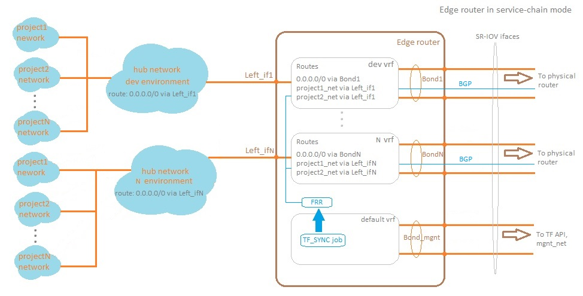

# Deploy OpenStack with TunstenFabric network component

## General architecture scheme
 

## General MAAS architecture scheme
 

## Install
Walk through follow steps
```bash
apt install virtualenv python3-pip apt-transport-https ca-certificates curl gnupg-agent git python jq
virtualenv osh-venv
source osh-venv/bin/activate
git clone <repository url>
cd openstack-contrail
git submodule init
git submodule update
for i in . kolla kubespray;do pip3 install -r $i/requirements.txt;done
#Add dns server where resides keystone record
```

## Description of inventory directory
Some shell output was omitted
```bash
inventory # Inventory dir contain different files grouped by region
├── regionOne # OS region name 
│   ├── artifacts # Directory contain downlonded or generated from tempalte files
│   │   ├── admin.conf # KUBECONFIG file for connect to deployed kubernetes cluster
│   │   ├── cloud.yaml # Admin credentials for connect to deployed Openstack
│   │   ├── helm_vars_ceph-mon.yaml # Generated files for override default helm charts values
│   │   ├── helm_vars_ceph-openstack-config.yaml
│   │   └── kubectl # Dowloaded binary file for manage kubernetes cluster
│   ├── credentials # Directory contain sensitive data like passwords and tokens. !!!DON'T DELETE THIS FILES!!!
│   │   ├── ceph_object_store.elasticsearch.secret_key.creds
│   │   ├── contrail_endpoints.rabbitmq.creds
│   │   ├── maas.ui.creds
│   │   ├── nagios.admin.creds
│   │   ├── oslo_db.admin.creds
│   │   └── prometheus_mysql_exporter.user.creds
│   ├── group_vars # Default ansible location for variables
│   │   ├── all # Variables for all ansible host groups
│   │   │   ├── all.yml
│   │   │   ├── docker.yml
│   │   │   └── osh.yml # The main config file for roles in this repo
│   │   ├── etcd.yml
│   │   └── k8s-cluster # Variables for k8s-cluster ansible group
│   │       ├── addons.yml
│   │       ├── k8s-cluster.yml
│   │       └── k8s-net-calico.yml
│   ├── helm_vars # Suppementary vars dir. Files are included to role using include_vars 
│   │   ├── components.yaml # File contain components which must be deployed
│   │   ├── endpoints.yaml # File contain different endpoints of components. Such as username, password, fqdn
│   │   ├── images.yaml # What images will be used
│   │   └── replicas.yaml # How many replicas will be used
│   ├── hosts.yaml.sample # Example of static inventory file for deploy openstack-contrail
│   ├── inventory.py # Dymanic inventory file. It gets info from MAAS
│   └── maas.ini # Inventory file for deploy MAAS
└── share_creds # Directory contain some sensitive data required for use generated info through different
    │           # role and deployment
    ├── ceph.regionone.creds
    ├── identity.admin.creds
    ├── maas.region.endpoint
    └── maas.ssh.key.pub
```

## Images
For deploy kolla images are used (except some of images). See more information about build it in kolla repository. Only stable/queens brach is used now.

## Kebernetes
For deploy k8s kubespray is used (custom_kubespray branch)

## Deploy
1. Install jump server
  - Install Ubuntu 18.04 on one server/vm
  - Configure one network interface for ansible (example netplan config in bond_netplan.example)
  - Configure maas.ini inventory file
  - Deploy maas server to jump server (deploy_maas.yaml)
    ```bash
    ansible-playbook -i path_to_inventory deploy_maas.yaml
    ```
2. Provision BM servers
 - Login on maas server and pass postinstall wizard
 - Run BM server with enabled PXE. Ensure that DHCP is enabled in MAAS
 - Configure IPMI parameters, add servers to appropriate zone in maas and commision its
 - Configure servers:
   - Set node role. To do that, you need to set role tags in Configure->Machine configuration->Tags
     > Avaliable tags: osd-nodes, compute-plane, control-plane
     >
     > !!! Don't foget to tag MAAS controller node, if it participates in cluster !!!
   - Create bond in Interfaces tab
   - Select appropriate subnet and set "static assign" mode
   - Set tag to interface if it's required. If you use vlan, you need to tag parent interface for vlan subinterface.
     > For ex. ceph and k8s vlan will be based on bond interface, bond must be tagged as "k8s", "ceph". Only "k8s" and "ceph" tags avalible now.
   - To tag journal disk, you need set "journal" tag to appropriate disk in Storage tab
 - Deploy OS
3. Deploy OSH
 - Check configs in inventory directory for appropriate region. Also find out default values in roles/<role_name>/defaults/main.yml
 - Run ansible playbook with dynamic inventory file. 
   ```bash
   ansible-playbook -i inventroy/<region_name>/inventory.py
   ```
   Useful ansible tags:
    - init - Prepare nodes and deploy k8s
    - pre-k8s - Prepare nodes
    - k8s - Deploy k8s
    - post-k8s - Postconfig k8s and add lables
    - routes - Add routes for ceph multy region interconnect
    - osh-contrail - deploy OSH to k8s
    - cinder-backup - redeploy cinder-backup. Useful when was deployed region for backup to
4. Deploy Edge router if needed
   ```bash
   ansible-playbook -i inventroy/<region_name>/inventory.py deploy_edge.yaml

## Edge router
Edge router can work in two mode:
- service chain
- evpn
> Now deploy in EVPN mode is not supported
### Edge router scheme in service chain mode
 
### Edge router scheme in evpn mode
 

## TODO
- [ ] Adding new node to cluster
- [ ] Update OpenStack components (include update to new OS release)
- [x] Update edge image without downtime. Now complete with error
- [ ] Deploy through gitlab-ci
- [ ] Change manager of ceph-mon service endpoint from bash to k8s operator
- [ ] Build all images by kolla. See inventory/regionOne/helm_vars/images.yaml to find out external images.
